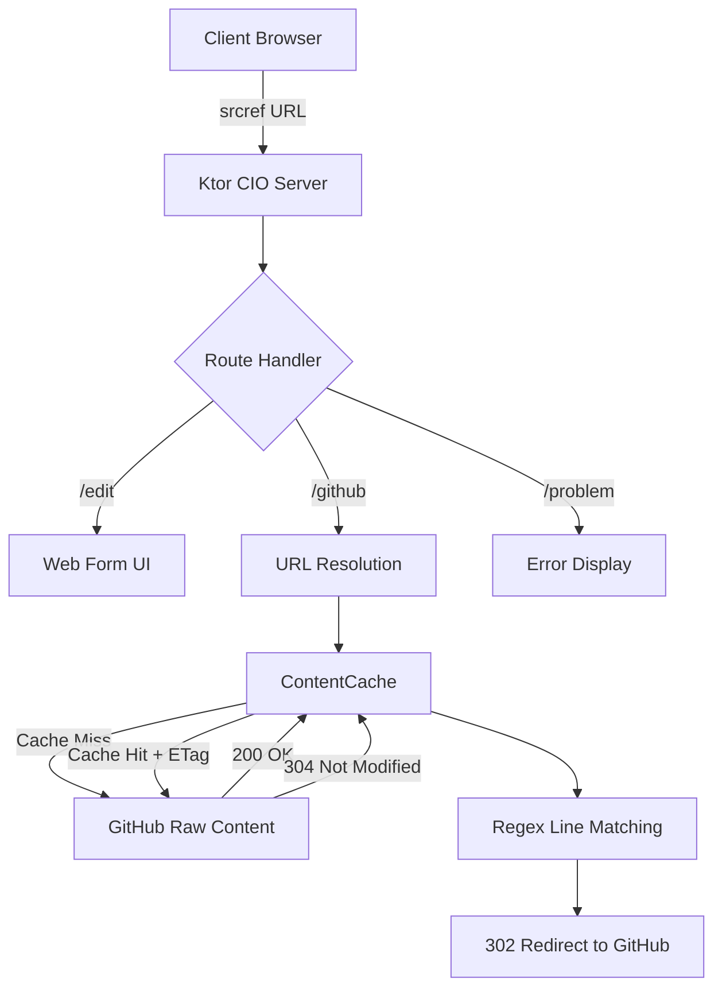

# Deployment

srcref can be used via the public service at [www.srcref.com](https://www.srcref.com)
or self-hosted for private repositories and custom configurations.

## Public Service

The easiest option — just use [www.srcref.com](https://www.srcref.com). No setup required.
Works with any public GitHub repository.

## Environment Variables

All deployment methods support these environment variables:

```
--8<-- "src/test/kotlin/website/DeploymentExamples.kt:env-vars"
```

| Variable         | Default                  | Description                     |
|------------------|--------------------------|---------------------------------|
| `PORT`           | `8080`                   | HTTP server port                |
| `PREFIX`         | `https://www.srcref.com` | URL prefix for generated links  |
| `DEFAULT_BRANCH` | `master`                 | Default branch when not specified |
| `MAX_CACHE_SIZE` | `2048`                   | Maximum cached file entries     |
| `MAX_LENGTH`     | `5242880` (5MB)          | Maximum file size to process    |

## Local Development

```bash
--8<-- "src/test/kotlin/website/DeploymentExamples.kt:local-dev"
```

## Fat JAR

Build a self-contained JAR that includes all dependencies:

```bash
--8<-- "src/test/kotlin/website/DeploymentExamples.kt:fat-jar"
```

## Docker

### Running with Docker

```bash
--8<-- "src/test/kotlin/website/DeploymentExamples.kt:docker-run"
```

### Docker Compose

```yaml
--8<-- "src/test/kotlin/website/DeploymentExamples.kt:docker-compose"
```

### Building the Docker Image

The project includes a multi-architecture Docker build (amd64/arm64) using
Alpine Linux with OpenJDK 17 JRE:

```bash
make release
```

## Heroku

srcref includes a `system.properties` file for Heroku's Java runtime (Java 17):

```bash
--8<-- "src/test/kotlin/website/DeploymentExamples.kt:heroku"
```

## Endpoints Reference

Once deployed, these endpoints are available:

| Path           | Purpose                               |
|----------------|---------------------------------------|
| `/edit`        | Main web form UI                      |
| `/github`      | Redirect to computed GitHub permalink |
| `/github?edit` | Edit an existing srcref URL           |
| `/problem`     | Error display with message            |
| `/ping`        | Health check (returns `pong`)         |
| `/what`        | About srcref                          |
| `/cache`       | Cache status table                    |
| `/version`     | Version and build info                |
| `/threaddump`  | JVM thread dump                       |

### Health Checks

Use `/ping` for health checks — it returns `pong` with a `text/plain`
content type. This endpoint is excluded from request logging to avoid
noise.

### Cache Monitoring

The `/cache` endpoint displays a table of all cached file entries with:

- URL of the cached file
- ETag value
- Content length
- Age since first cached
- Time since last referenced
- Number of hits

## Architecture Overview



The server uses:

- **Ktor CIO** — non-blocking coroutine-based HTTP server
- **ContentCache** — in-memory LRU cache with ETag-based revalidation
- **Background daemon** — evicts stale cache entries every 5 minutes
- **Compression** — gzip and deflate response compression
- **CallLogging** — request logging (excludes health checks and bot probes)
