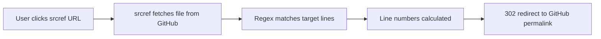

# srcref

**Dynamic line-specific GitHub permalinks using regex patterns.**

## The Problem

Embedding line-specific GitHub permalinks in documentation is fragile. When someone edits
the target file — adding, removing, or moving lines — your carefully crafted `#L42-L56` link
silently points to the wrong code.

## The Solution

**srcref** uses regex patterns to dynamically locate code sections at link-click time, generating
GitHub permalinks that remain accurate even as files change.

Instead of:

```
https://github.com/user/repo/blob/main/src/App.kt#L42-L56
```

Use a srcref URL that *finds* the code by pattern:

```
https://www.srcref.com/github?account=user&repo=repo&path=src/App.kt&bregex=fun+main
```

When someone clicks the link, srcref fetches the current file, locates the matching line,
and redirects to the correct GitHub permalink — no matter how the file has changed.

## Key Features

- **Dynamic permalinks** that survive code changes
- **Regex-based targeting** for precise code section selection
- **Line ranges** to highlight multiple lines from begin to end patterns
- **Occurrence selection** to pick the Nth match when patterns repeat
- **Bidirectional search** — search top-down or bottom-up
- **Line offsets** to adjust the highlight above or below the match
- **Programmatic API** available on Maven Central for automation
- **Self-hostable** for private repositories

## Quick Example

Here's how to create a srcref URL that highlights the `main` function in this project:

```kotlin
--8<-- "src/test/kotlin/website/ApiExamples.kt:basic-usage"
```

This generates a URL that, when visited, dynamically finds `fun main` in `Main.kt` and
redirects to the correct GitHub permalink.

## How It Works



1. **You provide** a GitHub file path and regex patterns
2. **srcref fetches** the current file content (with intelligent caching)
3. **Regex matching** locates the target lines dynamically
4. **srcref redirects** to the precise GitHub permalink with line numbers

## Next Steps

- **[Getting Started](getting-started.md)** — Create your first srcref URL in minutes
- **[Query Parameters](query-parameters.md)** — Full reference for all 12 URL parameters
- **[Regex Guide](regex-guide.md)** — Learn regex patterns for targeting code
- **[Programmatic API](api.md)** — Generate srcref URLs from Kotlin code
- **[Advanced Usage](advanced-usage.md)** — Offset tricks, bottom-up search, and more
- **[Deployment](deployment.md)** — Self-host for private repositories
